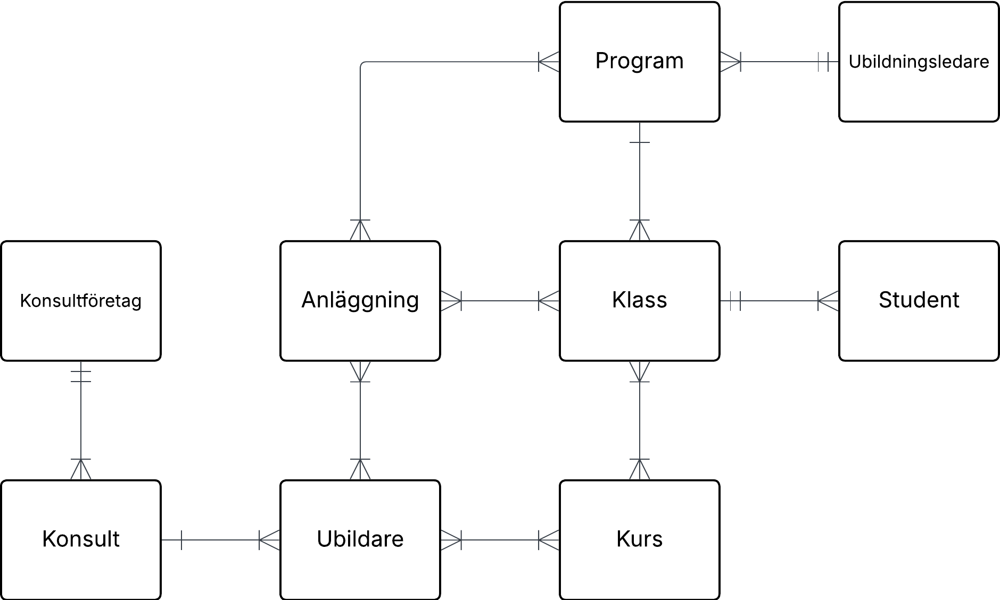

## Konseptuell modell 1:

Första modellen.

## Konseptuell modell 2:

Andra modellen. Kopplingen mellan Anläggning och Utbildare togs bort och koppling mellan Utbildare och Utbildningsledare skapades. Detta utifrån ändringar i den logiska modellen.

## Konseptuell modell 3:

Tredje modellen. Relation Labels lades till, texten som ligger intill linjerna, för att visa/förtydliga hur entiteterna är kopplade.